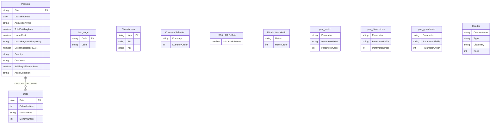

# Portfolio Report -- Developer Guide

> Audience: developers who will maintain or extend this Power BI report.
> Last updated: March 2026

---

## Table of Contents

1. [Project Structure](#1-project-structure)
2. [Data Model](#2-data-model)
3. [Metrics and DAX Measures](#3-metrics-and-dax-measures)
4. [Measure Display Folders](#4-measure-display-folders)
5. [saveForDeletion -- Unused Measures](#5-savefordeletion----unused-measures)
6. [Visuals That Depend on Complex DAX](#6-visuals-that-depend-on-complex-dax)
7. [Maintenance Points](#7-maintenance-points)
8. [Known Quirks](#8-known-quirks)
9. [Quick Reference](#9-quick-reference)

---

## 1. Project Structure

This is a Power BI PBIP project (`.pbip` format) with two main artefacts:

| Folder | Contents |
|---|---|
| `Portfolio Report.SemanticModel/` | Semantic model: tables, measures, relationships (TMDL) |
| `Portfolio Report.Report/` | Report definition: pages, visuals, bookmarks (JSON) |
| `scripts/` | Python automation scripts used during bilingual setup |
| `templates/` | Reusable JSON visual templates (LTR + RTL) |

### Report Pages (14 total)

| LTR (English) | Page ID | RTL (Arabic) | Page ID |
|---|---|---|---|
| Portfolio Overview | `a94a0faa68953005c758` | نظرة عامة على المحفظة | `9901ef1bd1854b738da4` |
| Expiring | `fb2af5ee013969b10d97` | انتهاء الإيجار | `665677beaa724871b7a8` |
| Owned | `7bf3b52072bc0010dc4c` | المملوكة | `a807f88b4f3d4ce39fcc` |
| Distribution | `2e769a070bd14019d45b` | التوزيع | `9369177f48414d41a95f` |
| Property Info | `bbd89d7022b1b0b40b43` | معلومات العقار | `01808cd02ce34c308d6c` |
| info | `a355a9de5d8b8a070096` | معلومات | `17b97c85e6f84edf87cf` |

Page order is defined in `Portfolio Report.Report/definition/pages/pages.json`.

---

## 2. Data Model

### 2.1 Diagram



### 2.2 Core Tables

**Portfolio** -- Main fact table.
- File: `Portfolio Report.SemanticModel/definition/tables/Portfolio.tmdl`
- Source: M partition reads from a CSV file (currently hardcoded to a local path; see [Maintenance Points](#7-maintenance-points)).
- Uses the **Header** table at query time for dynamic column type mapping.
- Key columns: `Site` (computed unique key), `Lease End Date ` (trailing space), `Acquisition Type`, `Total Building Area (m2)`, `Lease Cost  ` (trailing spaces), `Lease Payment Frequency`, `Exchange Rate vs. SAR (per XE.com)`, `Country`, `Continent`, `Building Utilization Rate`, `Asset Condition`, `Rent / Acquisition Cost (SAR)`, `Acquisition Cost SAR`, `Annual Rent SAR`.

**Date** -- Calculated table.
- File: `Portfolio Report.SemanticModel/definition/tables/Date.tmdl`
- DAX: `CALENDARAUTO()` filtered to the year range of `Portfolio[Lease End Date ]`.
- Columns: `Date`, `Calendar Year`, `Month Name`, `Month Number`.
- Depends on Portfolio being loaded first; if Portfolio is empty the Date table will be empty.

**Relationship** (single): `Portfolio[Lease End Date ]` -> `Date[Date]`.
Defined in `Portfolio Report.SemanticModel/definition/relationships.tmdl`.

### 2.3 Disconnected / Parameter Tables

These tables have **no relationship** to Portfolio. They drive slicers and dynamic measure switching.

| Table | Type | File | Purpose |
|---|---|---|---|
| **Language** | Calculated (DATATABLE) | `tables/Language.tmdl` | Two rows: `EN`, `AR`. Drives `[Selected Language]` measure and all Label measures. |
| **Translations** | Calculated (DATATABLE) | `tables/Translations.tmdl` | 119 key/value rows (Key, EN, AR). Lookup target for every `Label - *` measure. |
| **Currency Selection** | Import (M) | `tables/Currency Selection.tmdl` | Two rows: USD (order 1), SAR (order 2). Drives currency switching in rent/cost measures. |
| **USD to AR ExRate** | Calculated (GENERATESERIES) | `tables/USD to AR ExRate.tmdl` | Range 3.00 -- 5.00 (step 0.01). Default 3.75. Used for SAR-to-USD conversion. |
| **Distribution Metric** | Import (M) | `tables/Distribution Metric.tmdl` | Three rows: Rent to Area Ratio, Area, Annual Rent. Drives six switch measures (Median, Q1, Q3, IQR, Min, Max Distribution). |
| **prm_metric** | Calculated (field parameter) | `tables/prm_metric.tmdl` | Maps display names to measures: Sites Leased, Leased Area (m2), Annual Rent. Used on the Expiring page for dynamic chart values. Contains the `[Dynamic Running Sum]` measure. |
| **prm_dimensions** | Calculated (field parameter) | `tables/prm_dimensions.tmdl` | Maps display names to Portfolio dimension columns (Continent, Country, Building Type, Level 2 FA Module, Nature Of Use, Property Type). |
| **prm_quandrants** | Calculated (field parameter) | `tables/prm_quandrants.tmdl` | Maps display names to quadrant measures (Quadrant 1--4). |
| **Header** | Import (M) | `tables/Header.tmdl` | Metadata table (ColumnName, Type, Dictionary, Keep). Used by the Portfolio M query for column type mapping. |

---

## 3. Metrics and DAX Measures

All business measures live in the `_Measures` table (`Portfolio Report.SemanticModel/definition/tables/_Measures.tmdl`), except for a few that live in their driving tables:

| Table | Measures |
|---|---|
| `_Measures` | 187 measures (core KPIs, cost, expiring, distribution, quadrant, labels, etc.) |
| `Distribution Metric` | `Median Distribution`, `Q1 Distribution`, `Q3 Distribution`, `IQR Distribution`, `Min Distribution`, `Max Distribution` |
| `prm_metric` | `Dynamic Running Sum` |
| `USD to AR ExRate` | `USD to AR ExRate Value` |

### 3.1 Measure Dependency Chains

Understanding these chains is critical before changing any measure.

#### Rent / Currency Chain

```
Total Annual Rent (SAR)          -- SUMX: Lease Cost * frequency multiplier * exchange rate
  -> Total Annual Rent (USD)     -- divide by USD-to-SAR rate (default 3.75)
       -> Total Annual Rent      -- SWITCH on Currency Selection (1=USD, 2=SAR)
```

The same pattern applies to:

```
Total Annual Rent with Area (SAR)  ->  Total Annual Rent with Area(USD)
  -> Total Annual Rent with area   -- SWITCH on Currency Selection

Total Adquisition Cost (SAR)  ->  Total Acquisition Cost (USD)
  -> Total Acquisition Cost        -- SWITCH on Currency Selection
```

**If you add a new currency**: add a row to Currency Selection, then extend the SWITCH in `[Total Annual Rent]`, `[Total Annual Rent with area]`, and `[Total Acquisition Cost]`.

**If you change the default exchange rate**: update the COALESCE fallback in `[Total Annual Rent (USD)]` and `[Total Acquisition Cost (USD)]`.

#### Expiring / Lease Window

Multiple measures share the same filter pattern:

```dax
DATEDIFF(TODAY(), 'Portfolio'[Lease End Date ], MONTH) <= 36 &&
DATEDIFF(TODAY(), 'Portfolio'[Lease End Date ], MONTH) > 0
```

Measures using this filter:
- `[Expiring <=36 Months]`
- `[Upcoming Total Rent Lease Ending < 3 yrs]`
- `[Upcoming End of Leases Total Area (sqm)]`
- `[CF Rent at Risk]`

**If you change the window** (e.g. 36 months to 24 months): find-and-replace `<= 36` in all four measures.

#### Distribution Statistics

```
Net Rent to Area Ratio ($/sqm)  =  [Total Annual Rent with area] / [Total Leased Area (m2)]
  -> Median Rent to Area Ratio    (MEDIANX per site)
  -> Q1 / Q3 Rent to Area Ratio  (PERCENTILEX.INC)
  -> IQR Rent to Area Ratio       = Q3 - Q1
  -> Min / Max Rent to Area Ratio (MINX / MAXX)
```

These feed into the **Distribution Metric switch measures** in `Distribution Metric.tmdl`:

```
Median Distribution  =  SWITCH(selected metric, 1=[Median Rent to Area Ratio], 2=[Median Area], 3=[Median Annual Rent])
Q1 Distribution      =  SWITCH(...)
Q3 Distribution      =  SWITCH(...)
...
```

**If you add a new distribution metric**: add a row to the Distribution Metric M table, then extend all six switch measures.

#### Quadrant Analysis

```
Global Median Area          -- CALCULATE(MEDIANX(...), ALL(Portfolio))
Global Median Annual Rent   -- CALCULATE(MEDIANX(...), ALL(Portfolio))
  -> Quadrant 1 - High Area, High Rent
     (COUNTROWS of sites where Area > MedianArea AND Rent > MedianRent)
```

The scatter visual on the Distribution page uses `[Global Median Annual Rent]` and `[Global Median Area]` as reference lines, and `[Quadrant 1 - High Area, High Rent]` for data. Changing the median definitions or the above/below logic affects both LTR and RTL quadrant visuals.

#### Dynamic Expiring Chart (prm_metric)

```
prm_metric parameter table  -->  prm_metric[Field] (slicer)
                             -->  [Dynamic Running Sum]  (SWITCH on selected metric)
```

`[Dynamic Running Sum]` evaluates to one of: `[Total Annual Rent]`, `[Total Leased Area (m2)]`, or `[Sites Leased]` with a date accumulation filter.

**If you add a new metric option**: add a tuple to the `prm_metric` calculated table source, then extend the SWITCH in `[Dynamic Running Sum]`.

#### Bilingual Label System

```
Language table  ->  [Selected Language]  =  SELECTEDVALUE(Language[Code], "EN")
                      -> Every "Label - *" measure uses [Selected Language]
                         to LOOKUPVALUE from Translations table
```

There are 67 `Label -` measures. They all follow the same pattern:

```dax
VAR _lang = [Selected Language]
VAR _en = LOOKUPVALUE('Translations'[EN], 'Translations'[Key], "THE_KEY")
VAR _ar = LOOKUPVALUE('Translations'[AR], 'Translations'[Key], "THE_KEY")
RETURN SWITCH(_lang, "AR", _ar, _en)
```

**To add a new translatable string**:
1. Add a row to the Translations DATATABLE in `Translations.tmdl` with Key, EN, AR values.
2. Add a `Label - <Name>` measure in `_Measures.tmdl` using the pattern above.
3. Bind the measure to the visual's title/subtitle/reference label in the visual JSON.

**To add a new language**:
1. Add a row to the Language calculated table (e.g. `{ "FR", "Francais" }`).
2. Add a column to the Translations DATATABLE (e.g. `"FR", STRING`).
3. Extend every `Label - *` measure to include a new LOOKUPVALUE and SWITCH branch.

---

## 4. Measure Display Folders

Every measure in `_Measures.tmdl` is assigned to a display folder. The folder structure:

| Folder | Count | Description |
|---|---|---|
| **Core KPIs** | 13 | Top-level counts and rates used on Overview and multiple pages |
| **Currency & Cost** | 13 | Currency-switched rent/cost measures and area ratios |
| **Expiring & Lease** | 3 | Lease-end window measures (< 36 months) |
| **Distribution** | 18 | Statistical distribution measures (median, Q1, Q3, IQR, min, max) for the Distribution page |
| **Quadrant Analysis** | 3 | Global medians and Quadrant 1 used in scatter visuals |
| **Visual Titles** | 4 | Dynamic chart titles, button labels, footer |
| **Bilingual** | 1 | `[Selected Language]` measure |
| **Labels** | 37 | Dynamic bilingual label measures for titles/subtitles |
| **Labels\KPI** | 20 | Dynamic bilingual label measures for KPI card reference labels |
| **saveForDeletion** | 65 | Measures not referenced in any visual, filter, label, or DAX chain -- see next section |

### Folder Contents (active measures)

**Core KPIs**
- `Total Sites`, `Sites Leased`, `Sites Owned`, `Sites Leased %`, `Sites Owned %`
- `Total Area (sqm)`, `Total Headcount`, `Total Capacity`
- `Average Utilization Rate`, `Expiring <=36 Months`
- `Count of strategic countries`, `Sites Leased with Area Data`
- `Underutilized Properties Count`

**Currency & Cost**
- `Total Annual Rent (SAR)`, `Total Annual Rent (USD)`, `Total Annual Rent`
- `Total Annual Rent with Area (SAR)`, `Total Annual Rent with Area(USD)`, `Total Annual Rent with area`
- `Total Leased Area (m2)`, `Total Owned Area (m2)`
- `Total Acquisition Cost`, `Total Adquisition Cost (SAR)`, `Total Acquisition Cost (USD)`
- `Total Cost`, `Net Rent to Area Ratio ($/sqm)`

**Expiring & Lease**
- `Upcoming Total Rent Lease Ending < 3 yrs`
- `Upcoming End of Leases Total Area (sqm)`
- `CF Rent at Risk`

**Distribution**
- Median: `Median Rent to Area Ratio`, `Median Annual Rent`, `Median Area`
- Q1/Q3: `Q1 Rent to Area Ratio`, `Q3 Rent to Area Ratio`, `Q1 Annual Rent`, `Q3 Annual Rent`, `Q1 Area`, `Q3 Area`
- IQR: `IQR Rent to Area Ratio`, `IQR Annual Rent`, `IQR Area`
- Min/Max: `Min Rent to Area Ratio`, `Max Rent to Area Ratio`, `Min Annual Rent`, `Max Annual Rent`, `Min Area`, `Max Area`

**Quadrant Analysis**
- `Global Median Area`, `Global Median Annual Rent`
- `Quadrant 1 - High Area, High Rent`

**Visual Titles**
- `Visual Title - Expiring Metric`, `Visual Title - Expiring Metric running Total`
- `Button - Info`, `Footer`

**Bilingual**
- `Selected Language`

---

## 5. saveForDeletion -- Unused Measures

The following 65 measures are **not referenced** in any visual, filter, label, reference label, bookmark, or in the DAX body of any measure that is referenced. They have been assigned `displayFolder: saveForDeletion` for review and potential removal.

**Before deleting any measure**, verify it is still unused by searching the report definition for the measure name:
```
grep -r "MeasureName" "Portfolio Report.Report/definition/"
```

### Outlier / Statistical Analysis (6)

| Measure | Reason unused |
|---|---|
| `Average Rent to Area Ratio` | Only fed into outlier measures below, which are also unused |
| `Rent to Area Ratio Std Dev` | Only fed into outlier thresholds below |
| `Outlier Threshold High` | Not bound to any visual |
| `Outlier Threshold Low` | Not bound to any visual |
| `Properties Above 20% Variance` | Not bound to any visual |
| `Outlier Properties Count` | Not bound to any visual |

### Expired Lease Variants (6)

| Measure | Reason unused |
|---|---|
| `Expired Leases Count` | Not bound to any visual |
| `Expired Leases Total Rent` | Not bound to any visual |
| `Expired Leases Total Area (sqm)` | Not bound to any visual |
| `Total Rent at Risk (USD)` | Report uses `Upcoming Total Rent Lease Ending < 3 yrs` instead |
| `Total Rent at Risk (SAR)` | Same as above |
| `Expired Leases Total Rent (USD)` | Not bound to any visual |

### Alternate Ratio Measures (3)

| Measure | Reason unused |
|---|---|
| `Net Rent to Area Ratio (USD/sqm)` | Report uses `($/sqm)` variant instead |
| `Net Rent to Area Ratio (SAR/sqm)` | Report uses `($/sqm)` variant instead |
| `Sharing Ratio` | Not bound to any visual |

### Standalone Measures (4)

| Measure | Reason unused |
|---|---|
| `Total Area at Risk (sqm)` | Not bound to any visual |
| `Upcoming Renewal Sites` | Not bound to any visual |
| `Properties with Area and Cost Data` | Not bound to any visual |
| `Properties with Missing Area and Cost` | Not bound to any visual |

### Median Comparison / Bucket Measures (6)

| Measure | Reason unused |
|---|---|
| `Properties Above Median Rent` | Not bound to any visual |
| `Properties Above Median Area` | Not bound to any visual |
| `Properties Above Both Medians` | Not bound to any visual |
| `Properties in Low Ratio Bucket` | Not bound to any visual |
| `Properties in High Ratio Bucket` | Not bound to any visual |
| `detail Rank` | Not bound to any visual |

### By-Continent Variants (12)

| Measure | Reason unused |
|---|---|
| `Properties Above Median Rent by Continent` | Not bound to any visual |
| `Properties Above Median Area by Continent` | Not bound to any visual |
| `Properties Above Both Medians by Continent` | Not bound to any visual |
| `Average Rent to Area Ratio by Continent` | Not bound to any visual |
| `Median Rent to Area Ratio by Continent` | Not bound to any visual |
| `Min Rent to Area Ratio by Continent` | Not bound to any visual |
| `Max Rent to Area Ratio by Continent` | Not bound to any visual |
| `Property Count by Continent` | Not bound to any visual |
| `Q1 Rent to Area Ratio by Continent` | Not bound to any visual |
| `Q3 Rent to Area Ratio by Continent` | Not bound to any visual |
| `IQR Rent to Area Ratio by Continent` | Not bound to any visual |

### Quadrant Variants (8)

| Measure | Reason unused |
|---|---|
| `Quadrant 2 - Low Area, High Rent` | Only Quadrant 1 is bound to the scatter visual |
| `Quadrant 3 - Low Area, Low Rent` | Same |
| `Quadrant 4 - High Area, Low Rent` | Same |
| `Total Properties in Quadrant Analysis` | Not bound to any visual |
| `Quadrant 1 - % of Total` | Not bound to any visual |
| `Quadrant 2 - % of Total` | Not bound to any visual |
| `Quadrant 3 - % of Total` | Not bound to any visual |
| `Quadrant 4 - % of Total` | Not bound to any visual |

### Portfolio Analysis Measures (9)

| Measure | Reason unused |
|---|---|
| `Portfolio Efficiency Score` | Not bound to any visual |
| `Properties with Missing Rent/Acquisition Data` | Not bound to any visual |
| `Properties with Missing Area Data` | Not bound to any visual |
| `Average Rent per Sqm by Property Type` | Not bound to any visual |
| `ROI on Owned Properties` | Not bound to any visual |
| `Properties in Poor Condition` | Not bound to any visual |
| `Potential Rent Recovery (Underutilized)` | Not bound to any visual |
| `Portfolio Health Score` | Not bound to any visual |
| `Data Completeness %` | Not bound to any visual |

### Country Analysis Measures (12)

| Measure | Reason unused |
|---|---|
| `Properties by Country` | Not bound to any visual |
| `Total Area by Country` | Not bound to any visual |
| `Total Annual Rent by Country` | Not bound to any visual |
| `Avg Rent per Sqm by Country` | Not bound to any visual |
| `Avg Utilization by Country` | Not bound to any visual |
| `Leased Properties by Country` | Not bound to any visual |
| `Owned Properties by Country` | Not bound to any visual |
| `Allocated Properties by Country` | Not bound to any visual |
| `Poor Condition by Country` | Not bound to any visual |
| `Underutilized by Country` | Not bound to any visual |
| `Portfolio Health Score by Country` | Not bound to any visual |
| `Properties Expiring by Country` | Not bound to any visual |

---

## 6. Visuals That Depend on Complex DAX

These visuals need special attention during maintenance because they depend on multi-measure chains, parameter-driven switching, or dynamic titles.

### 6.1 Expiring Page -- Dynamic Metric Charts

**Pages**: Expiring (`fb2af5ee013969b10d97`) and انتهاء الإيجار (`665677beaa724871b7a8`).

Visuals use `prm_metric` (field parameter) for dynamic chart values:

- **Slicer** bound to `prm_metric[Field]` lets the user pick Sites Leased, Leased Area, or Annual Rent.
- **Bar chart** (`aae2003eb0361e02cab4`) uses `prm_metric[Field]` as value.
- **Line chart** (`1f984d07519625da0060`) uses `prm_metric[Dynamic Running Sum]` for cumulative totals.
- **Bar chart** (`1083575658985c5a362a`) uses `[Upcoming Total Rent Lease Ending < 3 yrs]` and `[Total Leased Area (m2)]`.

Dynamic titles:
- `[Visual Title - Expiring Metric]` = `SELECTEDVALUE(prm_metric[Field]) & " by End of Lease Date"`
- `[Visual Title - Expiring Metric running Total]` = `"Running Total " & SELECTEDVALUE(prm_metric[Field]) & " by End of Lease Date"`

**Maintenance**: adding a new metric to prm_metric requires extending `[Dynamic Running Sum]` and optionally the two title measures.

### 6.2 Distribution Page -- Distribution Metric Switch

**Pages**: Distribution (`2e769a070bd14019d45b`) and التوزيع (`9369177f48414d41a95f`).

- **Box-and-whisker style chart** (`31b00430c9bbc1d9ec39`) uses all six Distribution Metric switch measures (Median, Q1, Q3, IQR, Min, Max Distribution).
- A **slicer** bound to `Distribution Metric[Metric]` lets the user toggle between Rent-to-Area Ratio, Area, and Annual Rent.
- **Bookmarks** (`eaaea27d567831a20b0c`, `40e0e5ec1a678039d471`) reference `[Median Rent to Area Ratio]`. If you rename this measure, update the bookmarks.

**Maintenance**: adding a new distribution metric requires a new row in the Distribution Metric M table and extending all six switch measures.

### 6.3 Quadrant / Scatter Visual

**Pages**: Distribution and المملوكة (Owned).

- **Scatter chart** (`5da3b2b4269a59d73202`) uses:
  - `[Global Median Annual Rent]` and `[Global Median Area]` as reference lines.
  - `[Quadrant 1 - High Area, High Rent]` for data.
  - `[Total Annual Rent with area]` and `[Total Leased Area (m2)]` as axes.

The Quadrant 1 measure builds a virtual table with `ADDCOLUMNS(SUMMARIZE(...))` and compares each site's area/rent to global medians. Changing the median logic or the quadrant threshold (above/below) affects the reference lines and data points.

### 6.4 KPI Cards -- Dynamic Labels

**Pages**: All pages (LTR and RTL).

KPI card visuals bind:
- **Value** to a business measure (e.g. `[Total Sites]`, `[Sites Leased]`).
- **Reference label title** to a `Label - KPI *` measure (e.g. `[Label - KPI Total Sites]`).

These labels resolve dynamically based on the Language slicer. Adding a new KPI card requires:
1. A translation key in Translations.
2. A `Label - KPI *` measure.
3. A visual JSON with the value measure and the label measure bound as reference label.

### 6.5 Currency-Switched Visuals

**Pages**: Portfolio Overview, Expiring, Owned.

Any visual showing rent or cost values uses `[Total Annual Rent]`, `[Total Annual Rent with area]`, or `[Total Acquisition Cost]`. These measures switch between USD and SAR based on the Currency Selection slicer. The detail tables (`4ddde983096102b4c089`) also use `[CF Rent at Risk]` for conditional formatting (icon set) to flag properties with upcoming lease expirations.

### 6.6 Detail Tables with Conditional Formatting

**Pages**: Portfolio Overview and نظرة عامة على المحفظة.

Visual `4ddde983096102b4c089` (and RTL equivalent) shows a property detail table with:
- Conditional formatting rules using `[CF Rent at Risk]` (returns 1 or 0) to highlight rows.
- `[Net Rent to Area Ratio ($/sqm)]` as a sorted/formatted column.

---

## 7. Maintenance Points

### 7.1 Data Source

The Portfolio table reads from a **hardcoded local CSV path**:

```
C:\Users\erika.lozada\Desktop\Projects\PortfolioReport\sample_dummy_data.csv
```

This path appears in two places:
1. `Portfolio Report.SemanticModel/definition/tables/Portfolio.tmdl` -- the M partition source.
2. `Portfolio Report.SemanticModel/definition/expressions.tmdl` -- the `sample_dummy_data` expression.

**For production**: replace the CSV path with the actual data source (SharePoint, database, etc.). A commented-out Excel/Web source exists in the Portfolio partition for reference.

If the source column set or types change, also update the **Header** table so the Portfolio M query's type mapping still matches.

### 7.2 USD to SAR Exchange Rate

- Default rate (3.75) is hardcoded as a fallback in `[Total Annual Rent (USD)]` and `[Total Acquisition Cost (USD)]` via `COALESCE(SELECTEDVALUE(...), 3.75)`.
- The slicer range is `GENERATESERIES(3, 5, 0.01)`. Adjust the range or step in `USD to AR ExRate.tmdl` if needed.

### 7.3 Adding a Metric to prm_metric

1. Add a tuple to the calculated table in `prm_metric.tmdl`:
   ```
   ("Display Name", NAMEOF('_Measures'[Measure Name]), <order>)
   ```
2. Extend `[Dynamic Running Sum]` SWITCH to include the new order number and measure.
3. If chart titles should reflect it, update `[Visual Title - Expiring Metric]` and `[Visual Title - Expiring Metric running Total]`.

### 7.4 Adding a Dimension to prm_dimensions

Add a tuple:
```
("Display Name", NAMEOF('Portfolio'[Column Name]), <order>)
```

### 7.5 Adding a Distribution Metric

1. Add a row to the Distribution Metric M table.
2. Extend all six switch measures: `Median Distribution`, `Q1 Distribution`, `Q3 Distribution`, `IQR Distribution`, `Min Distribution`, `Max Distribution`.

### 7.6 Translations and Labels

**Adding a new label**:
1. Add a row to the `Translations` DATATABLE in `Translations.tmdl`:
   ```
   {"KEY_NAME", "English text", "Arabic text"}
   ```
2. Add a `Label - <Name>` measure in `_Measures.tmdl`:
   ```dax
   VAR _lang = [Selected Language]
   VAR _en = LOOKUPVALUE('Translations'[EN], 'Translations'[Key], "KEY_NAME")
   VAR _ar = LOOKUPVALUE('Translations'[AR], 'Translations'[Key], "KEY_NAME")
   RETURN SWITCH(_lang, "AR", _ar, _en)
   ```
   Set `displayFolder: Labels` (or `Labels\KPI` for KPI reference labels).
3. Bind the measure to the visual's title/subtitle/reference label in the visual JSON file.
4. Optionally run `scripts/verify_bilingual.py` to check bindings.

**Changing existing label text**: only update the Translations DATATABLE row. No measure or visual changes needed.

**Changing a label key or measure name**: update all three places -- Translations row, measure DAX, and every visual JSON that references the measure (search for the old name in `Portfolio Report.Report/definition/**/*.json`).

### 7.7 Navigation Buttons

Navigation buttons use `visualLink` with `navigationSection` (not the deprecated `vcActions` property). When renaming or reordering pages, update the navigation targets in the relevant visual JSON files.

### 7.8 Python Automation Scripts

Scripts in `scripts/` were used for one-time bilingual setup. Re-run only when doing bulk changes to RTL pages.

| Script | Purpose |
|---|---|
| `main.py` | Page duplication, RTL mirroring, label binding |
| `bind_and_duplicate.py` | Batch-bind measures to visuals and duplicate pages |
| `bind_remaining.py` | Catch-up binding for visuals missed in initial pass |
| `verify_bilingual.py` | Validate that all RTL visuals have measure bindings |
| `rtl_alignment.py` | Right-align titles/subtitles on RTL pages |
| `rtl_axis_format.py` | Switch axis position and invert range for bar/scatter charts |
| `add_reference_line.py` | Add zero reference lines to bar charts |
| `translate_kpi_cards.py` | Translate KPI card labels and bind reference label measures |
| `fix_nav_buttons.py` | Replace deprecated `vcActions` with `visualLink` |
| `fix_nav_buttons_v2.py` | Fix `destinationSection` -> `navigationSection` schema |
| `assign_display_folders.py` | Assign display folders to all measures in _Measures.tmdl |

---

## 8. Known Quirks

| Issue | Detail |
|---|---|
| **Typo in measure name** | `[Total Adquisition Cost (SAR)]` -- the "d" instead of "c" is intentional in the model. Do not rename without updating `[Total Acquisition Cost]` and `[Total Acquisition Cost (USD)]`. |
| **Trailing spaces in column names** | `Lease End Date ` and `Lease Cost  ` have trailing spaces. Use the exact name (with spaces) in any DAX or M expression. |
| **Date table depends on Portfolio** | If Portfolio is empty or fully filtered out, the Date table range will be wrong (MinYear/MaxYear derive from Portfolio data). |
| **Footer measure binding** | The `Footer` measure is defined in `_Measures` but the report binds it as `Currency Selection.Footer` in some visuals. This is a legacy binding alias; the measure still resolves correctly. |
| **Total Rent at Risk alias** | The report uses the queryRef `_Measures.Total Rent at Risk` which maps to `[Upcoming Total Rent Lease Ending < 3 yrs]` via nativeQueryRef. The separate measures `[Total Rent at Risk (USD)]` and `[Total Rent at Risk (SAR)]` are unused. |
| **Total Leased Area alias** | The report references both `Total Leased Area (Sqm)` and `Total Leased Area (m2)` as queryRef / nativeQueryRef. These map to the same measure `[Total Leased Area (m2)]`. |

---

## 9. Quick Reference

Common maintenance tasks and where to make changes:

| Task | Files to Edit |
|---|---|
| Change data source path | `tables/Portfolio.tmdl` (M partition), `expressions.tmdl` |
| Change exchange rate default | `[Total Annual Rent (USD)]` and `[Total Acquisition Cost (USD)]` in `_Measures.tmdl` |
| Change expiring window (36 months) | Four measures in `_Measures.tmdl` (search `<= 36`) |
| Add a currency | `Currency Selection` M table + SWITCH in 3 measures in `_Measures.tmdl` |
| Add a metric to Expiring page | `prm_metric.tmdl` tuple + `[Dynamic Running Sum]` SWITCH |
| Add a distribution metric | `Distribution Metric` M table + 6 switch measures in `Distribution Metric.tmdl` |
| Add a dimension slicer option | `prm_dimensions.tmdl` tuple |
| Add a translation | `Translations.tmdl` row + `Label - *` measure + visual JSON binding |
| Add a new language | `Language.tmdl` row + `Translations.tmdl` column + extend all 67 Label measures |
| Rename/reorder a page | `pages.json` + page `page.json` displayName + navigation button visual JSONs |
| Delete an unused measure | Verify with grep, remove from `_Measures.tmdl`, check no visual references remain |

---

*Generated: March 2026*
